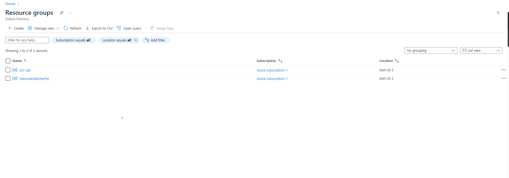
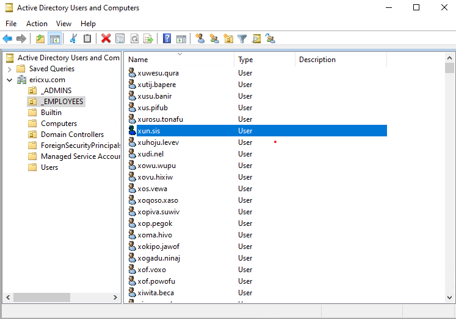

<h1>Active Directory - Deployment</h1>

 ### [YouTube Demonstration](https://youtu.be/7eJexJVCqJo)

<h2>Description</h2>
Project consists of setting up resources in Azure; connecting the client VM with the Domain Controller VM, installing Active Directory; creating Admin, user accounts, and OUs; joining the client to the domain; setting up non-admin users to login to the client; and creating a bunch of additional users and logging into the client as one of the users. 
<br />


<h2>Languages and Utilities Used</h2>

- <b>Server Manager</b> 
- <b>Powershell</b>
- <b>Active Directory</b> 
- <b>DNS</b> 
- <b>IP Addressing</b> 

<h2>Environments Used </h2>

- <b>Windows 10</b> (21H2)
- <b>Windows Server</b> (2022)
- <b>Microsoft Azure</b> 

<h2>Program walk-through:</h2>

<p align="center">
Setting up Resources <br/>
<!--  -->
<br />
<br />
Ensure Connectivity between client and DC  <br/>
<!--  -->
<br />
<br />
Active Directory Installed. Create Admin + Normal User Acounts  <br/>
<!--  -->
<br />
<br />
Join Client-1 to domain (ericxu.com)  <br/>
<!--  -->
<br />
<br />
Setup up Remote Desktop for non-admin users on Client-1  <br/>
<!--  -->
<br />
<br />
Creating a bunch of Users  <br/>
<!--  -->
<br />
</p>

<!--
 ```diff
- text in red
+ text in green
! text in orange
# text in gray
@@ text in purple (and bold)@@
```
--!>
